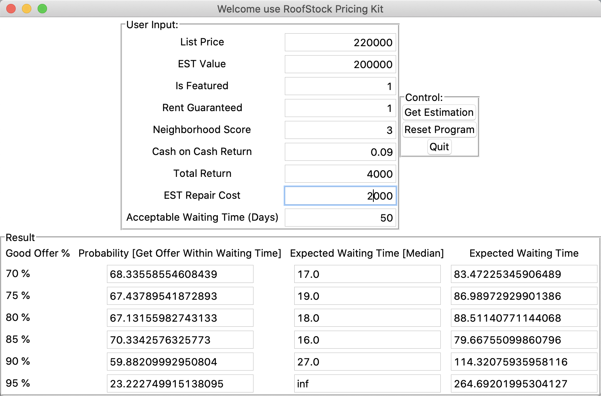

# Roofstock Project GUI Kit

## Background
[RoofStock.com](https://www.roofstock.com/) is the leading marketplace for investing in leased single-family rental (SFR) homes.
The company provides all of the resources for investors to buy,
own and sell real estate online, including data analytics, property management oversight and other tools.

In this project, students from university of maryland (us) will cooperate with RoofStock.com
to analyze the historical transaction data. Then built a predictive model to help RoofStock.com and platform users
(property sellers) to predict: for a specific listed house, how long will it take to sell at different price
(and get prediction at different confidence level).

By helping the sellers predict sell waiting time and set waiting expectation,
this project and the predictive model will help the platform to improve the (sellers') user experience

Since this project's target audiences are non-technical users, I built this tool kit with GUI(Graphical user interface).
The users could use this tool as a calculator:
    - simply input the required features of the listed property on RoofStock.com
    - the tool will give feedback and tell the expected waiting time at different confidence level
    
## Data & Model
- Data:
    - Provided by RoofStock.com
    - Due to privacy issue and Non-disclosure agreement, we will not post or share the transaction data.
- Model:
    - Survival Regression
    - Trained model files could be found and downloaded at [here](/model_files)
    - The main package and instructions we used are from [Lifelines](https://github.com/CamDavidsonPilon/lifelines/blob/master/docs/index.rst)
 
## Usage
- Pre-required Packages
    - pickle
    - pandas
    - tkinter

- In terminal type

```python
python main.py
```

- Input parameters:
    - list price
    - est value (estimated value)
    - is featured (is featured or not on roofstock.com)
    - rent guaranteed (is rent guaranteed or not)
    - neighborhood score
    - cash on cash return (calculated and provided by roofstock.com platform)
    - total return (calculated and provided by roofstock.com platform)
    - est repair cost
    - acceptable waiting time (users could try different days)
    
- output example: 
    
    
- Notes:
    - Result - Good Offer %: An offer from buyer to a sell, if the (offer price quote) >= x% * (List Price),
    it will be considered as a good offer
    - Result - Probability: For this specific listing, the probability that the sell will received a "Good Offer" within "Acceptable Waiting Time"
    - Result - Expected Waiting Time [Median]: model predicted waiting median (50 percentile) time
    - Result - Expected Waiting Time : model predicted (total) waiting time

## Contributing
Thanks for my teammates: 
- [Xukun LIU](https://www.linkedin.com/in/xukunliu1994/)
- [Jing LIU](https://www.linkedin.com/in/jing-liu1014/)
- [Jing WANG](https://www.linkedin.com/in/jing-wang-943b03171/)
- [Qi JIN](https://www.linkedin.com/in/qi-jin-0716/)

Special thanks to our capstone project sponsor: [RoofStock.com](https://www.roofstock.com/).
Roofstock.com kindly provided us with their valuable data to support this academic project.    